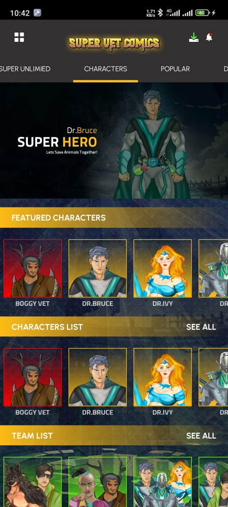

# SuperVet App


## Overview

SuperVet App is a mobile application designed for character enthusiasts and comic lovers. This app allows users to explore and interact with various character profiles, manage their user profiles, read comics, and earn points. Points can be used to unlock premium content and build teams. The intuitive and engaging user interface provides a seamless experience for both casual readers and avid collectors.

## Features

1. **Character Profiles**: Explore detailed profiles of various characters, including their background, abilities, and story arcs.
2. **User Profile**: Manage your personal information, view activity history, and track points.
3. **Comics Characters**: Dive into the world of comics with a collection of characters. Read their stories and follow their adventures.
4. **Download Characters**: Download character profiles for offline access. Never miss out on your favorite characters, even when you're not connected to the internet.
5. **Buy Paid Characters by Points**: Use earned points to unlock and buy exclusive paid characters. Enhance your collection with premium content.
6. **Read to Get Points**: Engage with the content by reading comics and character stories to earn points. The more you read, the more points you accumulate.
7. **Create Teams and Meet with Teams**: Build your own teams by selecting from a pool of characters. Meet and interact with other teams, fostering a sense of community and collaboration.

## Demo

Below are some screenshots of the app:

<div style="display: flex; flex-direction: row; flex-wrap: wrap; gap: 10px;">
    
    
    
    
    
    
   
    
    
</div>

## Installation

1. Clone the repository:
   ```bash
   git clone https://github.com/yourusername/supervet-app.git
   ```
2. Navigate to the project directory:
   ```bash
   cd supervet-app
   ```
3. Install the necessary dependencies:
   ```bash
   npm install
   ```
4. Run the development server:
   ```bash
   npm start
   ```
5. Open your mobile device emulator or connect your physical device to see the application in action.

## Usage

1. **View Character Profiles**: Browse through the app to explore different character profiles. Each profile contains detailed information about the character's background, abilities, and storyline.
2. **Manage User Profile**: Access and update your personal information through the user profile section.
3. **Read Comics**: Navigate to the comics section to read various character stories. Engaging with the content will help you earn points.
4. **Download and Unlock Characters**: Use points to download characters for offline viewing or to unlock exclusive paid characters.
5. **Create and Meet Teams**: Utilize the app's team-building feature to create your own team of characters. Connect with other teams to discuss strategies and stories.

## Technologies Used

- **Frontend**: React Native for mobile UI/UX.
- **Backend**: Node.js and Express.js for API handling and server-side logic.
- **Database**: MongoDB for storing user data and character information.
- **Authentication**: JWT (JSON Web Token) for user authentication and authorization.
- **Storage**: Cloud storage for hosting character data and downloadable content.

## Contributing

1. Fork the repository.
2. Create your feature branch: `git checkout -b feature/your-feature-name`.
3. Commit your changes: `git commit -m 'Add some feature'`.
4. Push to the branch: `git push origin feature/your-feature-name`.
5. Open a pull request.

## License

This project is licensed under the MIT License. See the [LICENSE](LICENSE) file for more details.

## Contact

For any questions or feedback, please reach out to iammalikkhalil@outlook.com.

Connect with me on [GitHub](https://github.com/iammalikkhalil), [LinkedIn](https://www.linkedin.com/in/iammalikkhalil), and other social media platforms using the username **iammalikkhalil**.

---

Thank you for using SuperVet App!